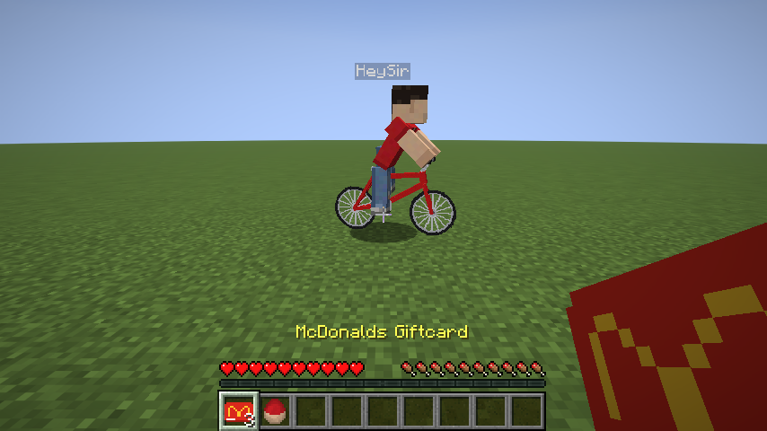

# GNV-Craft

A NeoForge mod for Minecraft Java 26.2 (NeoForge 26.2.0.89, the latest stable release) that turns the game into Gainesville, Florida.



## What's in it

- **A Gainesville world type.** Pick **GNV-Craft: Gainesville** under *More > World Type* when creating a world. The city is generated chunk by chunk from [OpenStreetMap](https://www.openstreetmap.org/) data baked into the mod: real roads, building footprints and heights, parks, water, parking lots and the airport. Origin (0, 0) is 13th St & University Ave, +X is east, +Z is south, 1 block = 1 m. V1 covers UF campus, Midtown and downtown, plus a separate patch around GNV airport (about 7 km east and 4.5 km north of the origin, so use `/gnv tp airport`); the land in between is empty grass.
- **Every building can be entered.** Buildings get a door at street level, rooms with doorways, window bands, lighting, ladders between floors and an **elevator** block on each floor of the shaft (right-click to go up, sneak + right-click to go down). Apartment buildings get units; bars get a counter, stools, a jukebox and a **bar tap**.
- **Bars and drinking.** Click a bar tap for a beer (sneak-click for a shot). Beer adds 1 to your drunk level, shots 1.5, cocktails 2. Your view sways, rolls and narrows, sounds get lower and wobbly, the screen goes black near the top, and at level 9 you die of alcohol poisoning. The level drops by 1 every 2 in-game hours.
- **Dennis** (13th St & University, by the Chick-fil-A): bald, very short pink shorts, cutoff green shirt. He dances all day and rambles about Linux at anyone who walks by.
- **HeySir** (below) still follows you around, in Gainesville worlds and normal ones.
- **Game day.** Every 7th in-game day the city fills with Gator fans in orange and blue. They only ever say "Go Gators!" (in different voices). On other days only the special NPCs exist (one Dennis, and each player's HeySir).
- **Lime scooters** parked along the main roads. Right-click one with a gold ingot to unlock it for one in-game day; only you can ride it, and it locks again when your day runs out.
- **A plane at GNV airport.** Right-click to board. W/S = throttle, A/D = steer, mouse = pitch, jump = brake on the ground. It needs to reach takeoff speed before it lifts off, and a hard impact blows it up.

## Commands (operators)

- `/gnv tp <place>`: `origin`, `airport`, or any named bar / restaurant from the map.
- `/gnv gameday start|stop|auto|status`
- `/gnv drunk <0-9>`
- `/heysir status|summon|reset`

## Honest limits of V1

- Buildings use real footprints and heights, but interiors are **generated**, not real. A researched per-building interior format (so The Standard, The Hub on 3rd Ave, bars, campus buildings and 201 NW 10th St can be rebuilt from floor plans) is not done yet.
- The Standard has no name tag in OpenStreetMap, so it is not singled out yet. The Hub exists as a building but has only a generated interior.
- Game day spawns a dense crowd of up to 300 fans around each player, not 90,000 entities.
- Drunk vision is camera sway, tunnel vision and a black overlay (no screen-warp shader), and audio distortion is pitch/volume wobble, not true filtering.
- Map data (c) OpenStreetMap contributors, ODbL. The map is rebuilt with `python3 tools/osm/fetch_gnv.py`.

## HeySir: how he behaves

- **First meeting:** about once per in-game day (on average) he appears 24-40 blocks away in the Overworld and rides toward you. Once he's close and can see you, he starts following.
- **Following:** he stays a few blocks behind you on his bike, sometimes getting off to walk it. If you outrun him he catches up, and he follows you into other dimensions and comes back after you relog.
- **Voice:** mostly "Hey Sir", sometimes "Hey Sir Excuse Me", very rarely "I have a wife and kids". Right-clicking him without a giftcard gets a "Hey Sir Excuse Me".
- **McDonalds Giftcard:** craft it from 8 gold ingots around a cooked beef. Right-click him with it and he rides off, then comes back to find you 3 in-game days later.
- **Killing him:** allowed. He comes back at the start of the next in-game day with double the health: 20, 40, 80, ... with no upper limit.
- Nobody else can ride his bike.

Each player gets their own HeySir. Days are counted on the Overworld clock, so sleeping and `/time add` count.

## Install

GNV-Craft needs **Minecraft Java 26.2** and **NeoForge 26.2.0.89** or newer in the 26.2 line. It does not load on older Minecraft or NeoForge versions such as 1.21.1.

1. Download the NeoForge installer for Minecraft 26.2 from [neoforged.net](https://neoforged.net/) and run it. Choose **Client**.
2. In the Minecraft Launcher, open **Installations**, edit the new NeoForge 26.2 installation, and set **Game directory** to a new folder such as `~/Library/Application Support/minecraft-gnvcraft`. That keeps this profile away from the mods folder of older versions, which would crash 26.2.
3. Get the mod jar:
   - Download `gnvcraft-2.0.0.jar` from the [GitHub releases](https://github.com/rileycleavenger/gnv-craft/releases) page, or
   - Clone this repo and build it: `git clone https://github.com/rileycleavenger/gnv-craft.git && cd gnv-craft && ./gradlew build`. The jar is `build/libs/gnvcraft-2.0.0.jar`. Building needs Java 25 (`brew install openjdk@25` on macOS).
4. Put `gnvcraft-2.0.0.jar` in that game directory's `mods` folder (create it if missing). NeoForge does not need a separate API jar.
5. Launch the NeoForge 26.2 installation.

In game, craft a McDonalds Giftcard with 8 gold ingots around a cooked beef, or use `/heysir summon` if cheats are on.

## Development

Needs Java 25. `gradle.properties` points Gradle at Homebrew's `openjdk@25` (`brew install openjdk@25`); change `org.gradle.java.home` if your JDK 25 lives elsewhere.

- `./gradlew runClient` launches a dev copy of the game with the mod.
- `./gradlew build` produces the jar in `build/libs/`.
- `./gradlew runGameTestServer` runs the gameplay tests in [src/gametest](src/gametest).
- `./gradlew runScreenshotClient` opens a flat world, poses HeySir, and saves screenshots under `run/screenshots/`.

### Art and voices

- `python3 tools/gen_textures.py` regenerates the skin, bike, item icons and mod icon (needs Pillow). `heysir.png` is a standard 64x64 player skin, so you can drop in any classic-arm skin instead.
- `tools/gen_voices.sh` regenerates the placeholder voice lines with macOS text-to-speech. To use real recordings, convert them to **mono** OGG and keep the same names in `src/main/resources/assets/gnvcraft/sounds/`:

  ```sh
  ffmpeg -i recording.m4a -ac 1 -ar 44100 -c:a libvorbis -q:a 5 src/main/resources/assets/gnvcraft/sounds/hey_sir_1.ogg
  ```

  Variants are listed in `src/main/resources/assets/gnvcraft/sounds.json`, so you can add or remove files there.
