# GNV-Craft

A NeoForge mod for Minecraft Java 26.2 (NeoForge 26.2.0.89, the latest stable release) that turns the game into Gainesville, Florida.

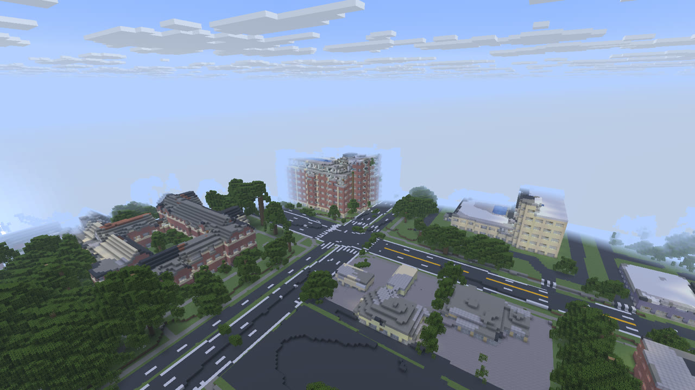

## Screenshots

| | |
|---|---|
| 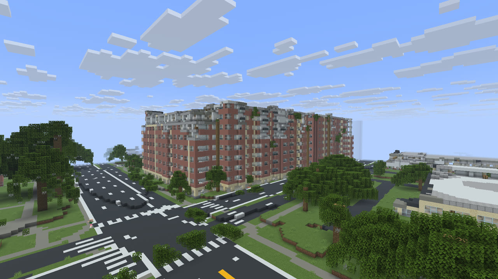 | 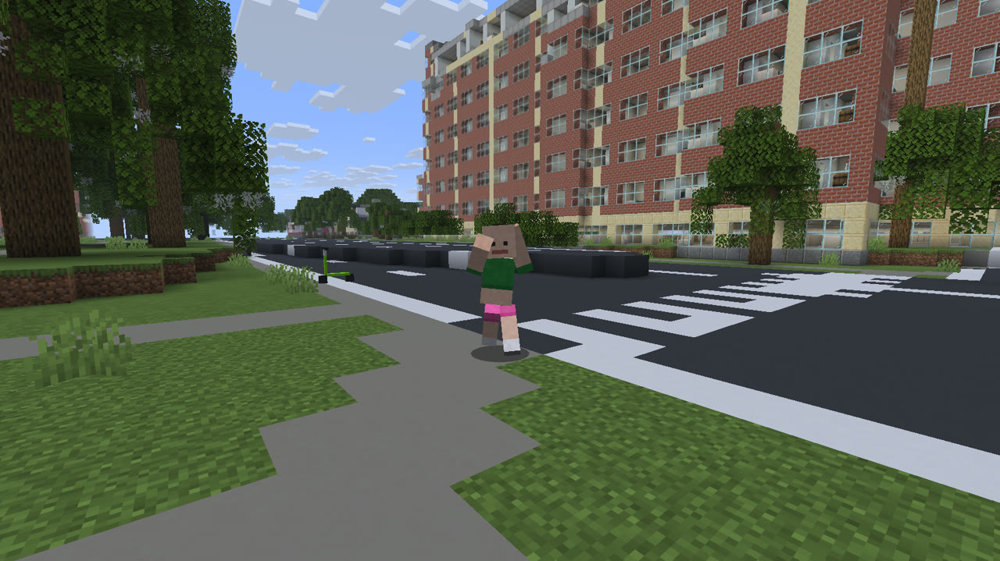 |
| The Standard over 13th & University (LiDAR footprint and height, facade from street photos) | Dennis dancing on the 13th & University corner |
| 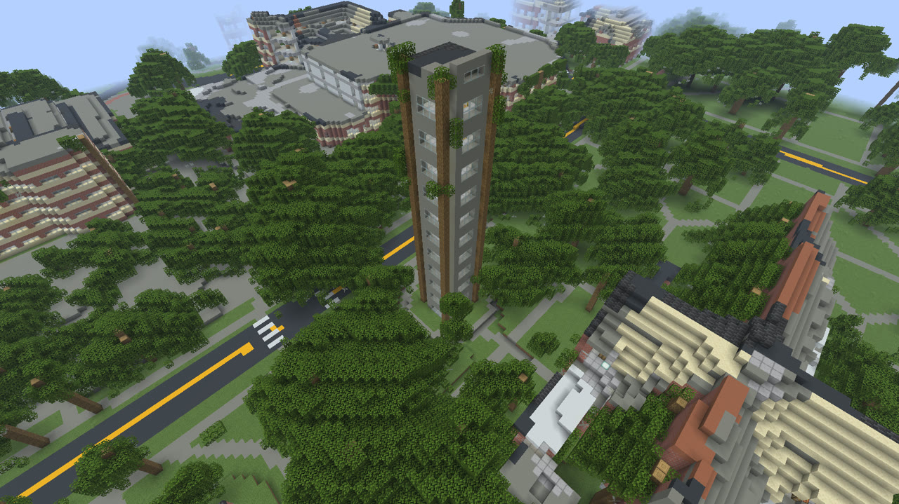 | 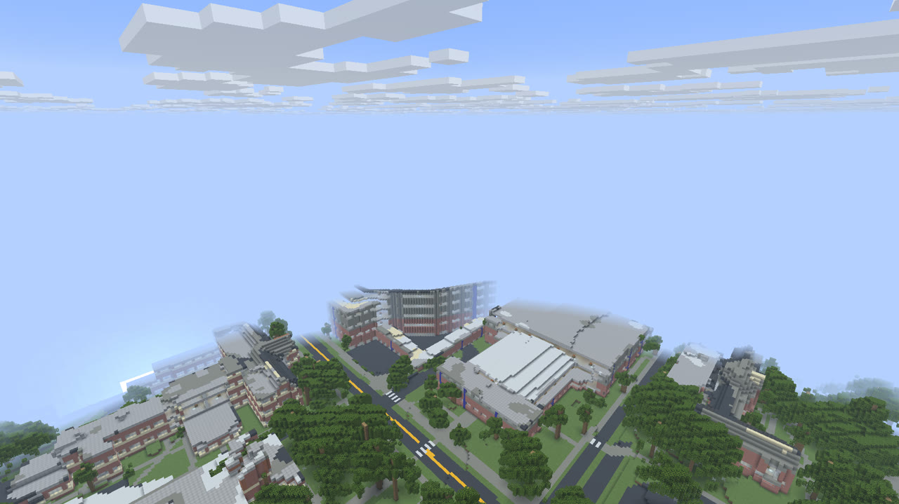 |
| Century Tower: brick with stone courses, real height from the laser scan | Around Ben Hill Griffin Stadium |
| 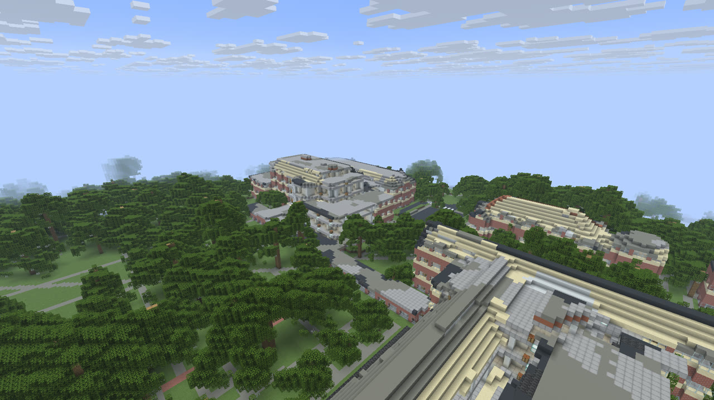 | 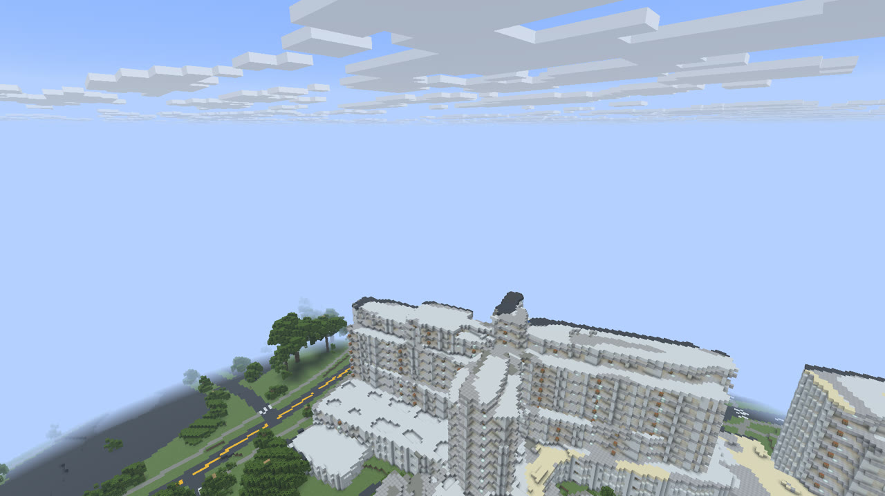 |
| Library West and the Plaza of the Americas | UF Health Shands |
| 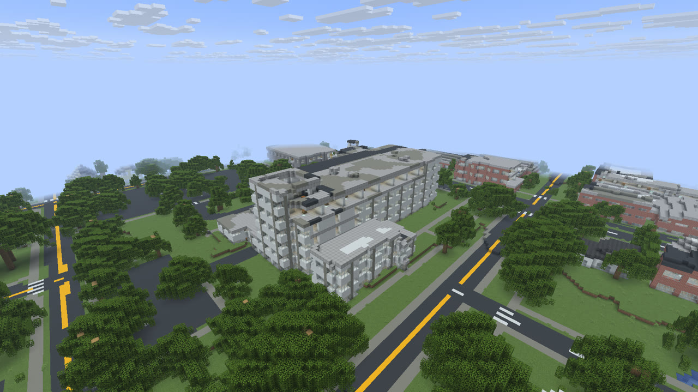 | 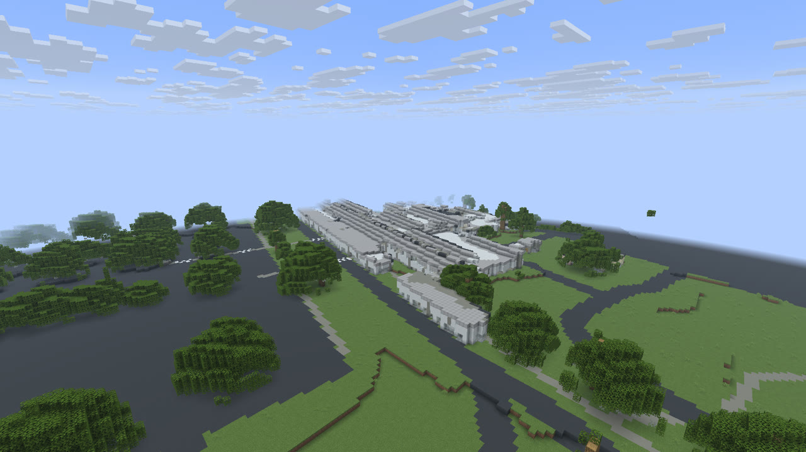 |
| Downtown: Alachua County Courthouse | Gainesville Regional Airport |
| 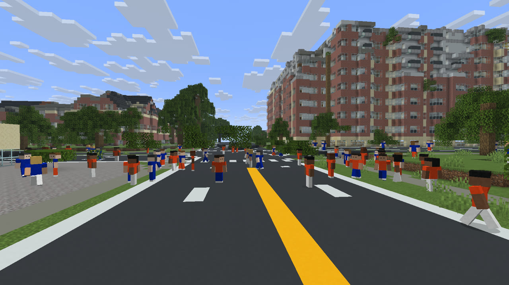 | 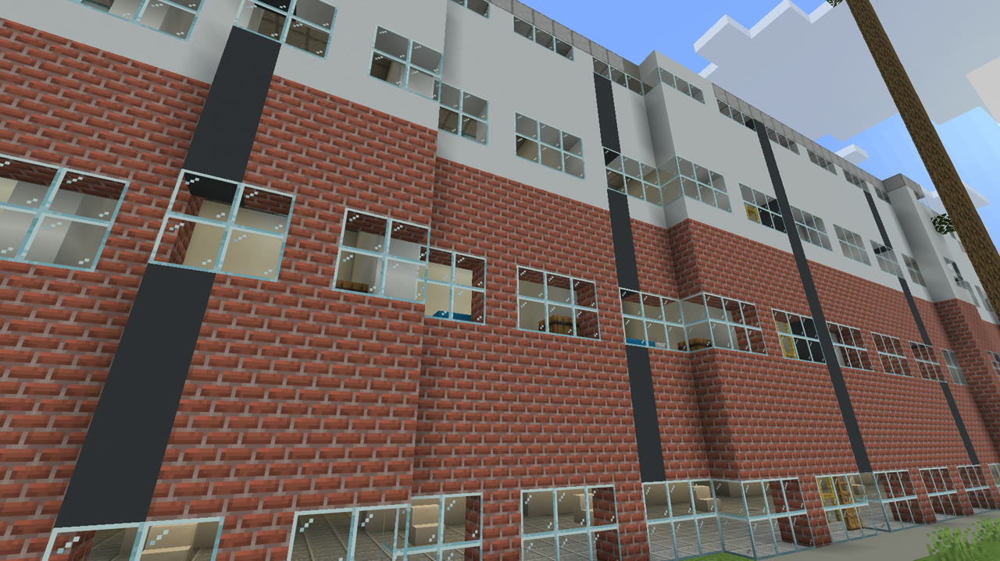 |
| Game day: Gator fans fill University Ave | Hub Gainesville (3rd Ave): brick base, white upper floors |
| 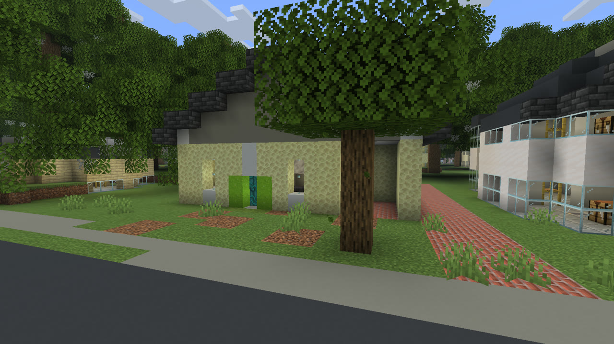 | 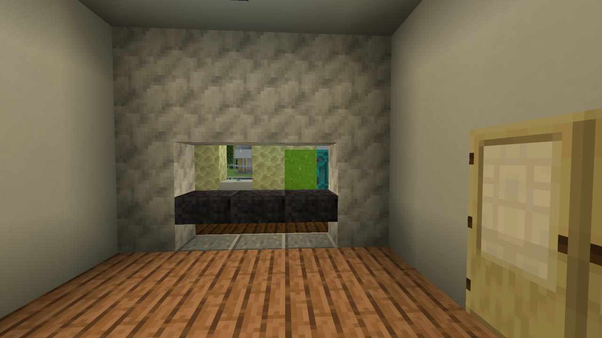 |
| 201 NW 10th St, rebuilt from its listing photos | Living room through the granite pass-through |
| 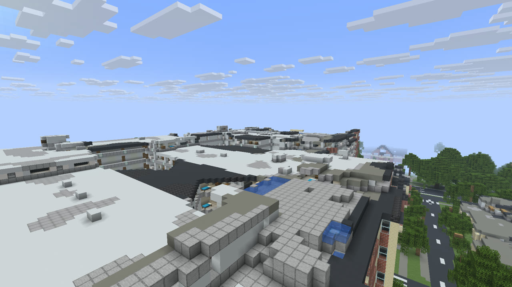 | 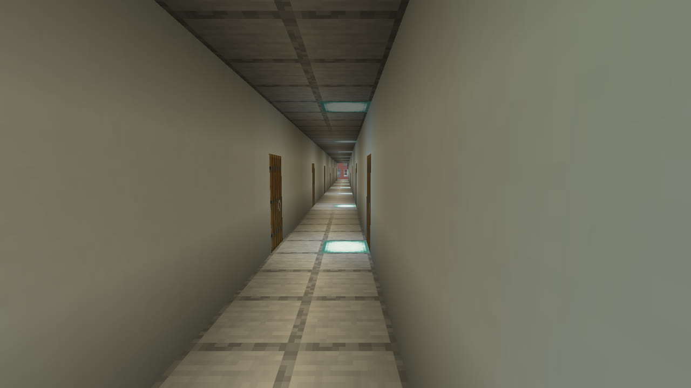 |
| The Standard's rooftop pools, placed from the aerial photo | Apartment corridor, units on both sides |
| 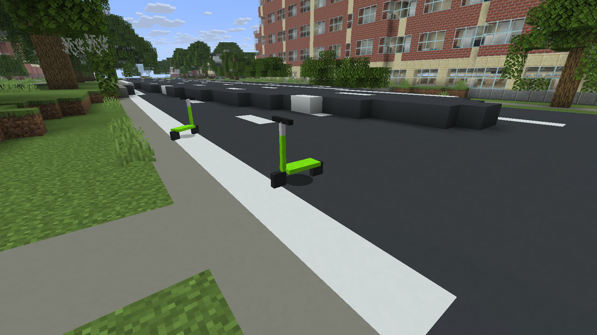 | 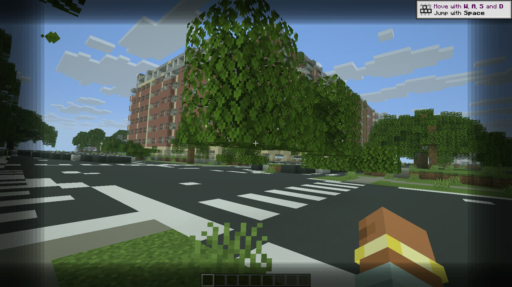 |
| Lime scooters, 1 gold ingot per in-game day | Drunk level 4 |

## What's in it

- **A Gainesville world type.** Pick **GNV-Craft: Gainesville** under *More > World Type* when creating a world. Origin (0, 0) is NW 13th St & W University Ave, +X is east, +Z is south, 1 block = 1 m.
  - **The whole V1 area is built from a laser scan:** UF campus, Midtown, downtown, the Duckpond, Depot Park and the corridor up to GNV airport (39 km², outline in `tools/lidar/v1_area.json`, 13,820 buildings). USGS 3DEP LiDAR (2018, about 22 points per m²) gives the real terrain, every building's real footprint and roof height, and every tree's real position, height and crown. The 2023 NAIP aerial photo gives roof colours and finds the rooftop pools. OpenStreetMap and Overture Maps give names, building types, lane counts, lane markings, crosswalks and sidewalks, plus buildings finished after the 2018 scan (like Hub Gainesville). Street photos from Mapillary set the facades of the landmarks (The Standard, the Hub, Holiday Inn, Publix, Midtown, the O'Connell Center, the Courthouse, Headquarters Library, Shands and UF's brick-and-stone buildings).
  - **Outside the outline** the world is flat OpenStreetMap roads and footprints, easing down from the real terrain at the edge. GNV airport is about 7 km east and 4.5 km north of the origin (`/gnv tp airport`).
- **Every building can be entered.** Doors face the nearest sidewalk. Each floor has rooms, lights, a scaffolding stair and an **elevator** pad (right-click to go up, sneak + right-click to go down). Apartment buildings get double-loaded corridors with units on both sides (kitchen, couch, bedroom), with a lobby on the ground floor. Bars get a counter, stools, a jukebox and a **bar tap**.
- **201 NW 10th St** is rebuilt by hand from its 37 listing photos on the footprint the LiDAR shows: yellow stucco, green doors, the carport, the brick driveway, the tile sunroom with the granite pass-through, the French doors, the white-tile kitchen, four bedrooms and three baths.
- **Bars and drinking.** Click a bar tap for a beer (sneak-click for a shot). Beer adds 1 to your drunk level, shots 1.5, cocktails 2. Your view sways, rolls and narrows, sounds get lower and wobbly, the screen goes black near the top, and at level 9 you die of alcohol poisoning. The level drops by 1 every 2 in-game hours.
- **Dennis** dances on the corner of 13th St & University by the Chick-fil-A: bald, very short pink shorts, cutoff green shirt. Walk by and he rambles about Linux.
- **HeySir** (below) still follows you around, in Gainesville worlds and normal ones.
- **Game day.** Every 7th in-game day the city fills with Gator fans in orange and blue. They only ever say "Go Gators!" (in six voices). On other days only the special NPCs exist (one Dennis, and each player's HeySir).
- **Lime scooters** are parked along the main roads. Right-click one with a gold ingot to unlock it for one in-game day; only you can ride it, and it locks again when your day runs out.
- **A plane at GNV airport.** Right-click to board. W/S = throttle, A/D = steer, mouse = pitch, jump = brake on the ground. It needs takeoff speed to lift off, and a hard impact blows it up.

## Commands (operators)

- `/gnv tp <place>`: `origin`, `airport`, `201 nw 10th`, or any named bar / restaurant from the map.
- `/gnv gameday start|stop|auto|status`
- `/gnv drunk <0-9>`
- `/heysir status|summon|reset`

## How accurate is it?

- **Exact (measured):** terrain, building footprints and roof heights, tree positions and sizes, and road layout across the V1 area. The aerial-photo overlays used to check this are made with `tools/lidar/overlay.py`.
- **Real but approximate:** roof colours (matched to the nearest Minecraft block), facades for the buildings checked against street photos, and storey counts. The LiDAR is from 2018, so anything built or torn down since then can differ; newer buildings come from Overture/OSM outlines with their tagged heights.
- **Generated, not real:** interiors. No public data has building interiors, so apartments, offices and bars get believable layouts that fit their real outlines. The only interior rebuilt from real photos so far is 201 NW 10th St. Wall materials of buildings without street-photo review are plausible picks for their type.
- **Facades checked against street photos:** about 20 landmark buildings (listed with their sources in `tools/lidar/overrides.json`). Mapillary has no usable photos of the Hippodrome, the Phillips Center or the airport terminal, so those are best guesses; send photos to correct them.
- **Outside V1:** the pipeline extends to any area (add points to `tools/lidar/v1_area.json`); each km² adds about 0.8 MB to the jar.
- Game day spawns a dense crowd of up to 300 fans around each player, not 90,000 entities. Drunk vision is camera sway, tunnel vision and a black overlay (no screen-warp shader), and audio distortion is pitch/volume wobble.

## Data sources and credits

- Map data (c) [OpenStreetMap](https://www.openstreetmap.org/copyright) contributors, ODbL 1.0.
- Building outlines from [Overture Maps](https://overturemaps.org/) (ODbL / CDLA Permissive 2.0, includes Esri Community Maps contributors and Microsoft ML Buildings).
- LiDAR: USGS 3D Elevation Program, FL_Peninsular_FDEM_Alachua_2018 (public domain).
- Aerial imagery: USDA NAIP 2023 (public domain), via Microsoft Planetary Computer.
- Street-level imagery used to set facades: [Mapillary](https://www.mapillary.com/) contributors, CC BY-SA 4.0.
- 201 NW 10th St: rebuilt from its listing photos (the photos are not included in the repo).

## HeySir: how he behaves

- **First meeting:** about once per in-game day (on average) he appears 24-40 blocks away in the Overworld and rides toward you. Once he's close and can see you, he starts following.
- **Following:** he stays a few blocks behind you on his bike, sometimes getting off to walk it. If you outrun him he catches up, and he follows you into other dimensions and comes back after you relog.
- **Voice:** mostly "Hey Sir", sometimes "Hey Sir Excuse Me", very rarely "I have a wife and kids". Right-clicking him without a giftcard gets a "Hey Sir Excuse Me".
- **McDonalds Giftcard:** craft it from 8 gold ingots around a cooked beef. Right-click him with it and he rides off, then comes back to find you 3 in-game days later.
- **Killing him:** allowed. He comes back at the start of the next in-game day with double the health: 20, 40, 80, ... with no upper limit.
- Nobody else can ride his bike.

Each player gets their own HeySir. Days are counted on the Overworld clock, so sleeping and `/time add` count.

## Install

GNV-Craft needs **Minecraft Java 26.2** and **NeoForge 26.2.0.89** or newer in the 26.2 line. It does not load on older Minecraft or NeoForge versions such as 1.21.1.

1. Download the NeoForge installer for Minecraft 26.2 from [neoforged.net](https://neoforged.net/) and run it. Choose **Client**.
2. In the Minecraft Launcher, open **Installations**, edit the new NeoForge 26.2 installation, and set **Game directory** to a new folder such as `~/Library/Application Support/minecraft-gnvcraft`. That keeps this profile away from the mods folder of older versions, which would crash 26.2.
3. Get the mod jar:
   - Download `gnvcraft-2.0.0.jar` from the [GitHub releases](https://github.com/rileycleavenger/gnv-craft/releases) page, or
   - Clone this repo and build it: `git clone https://github.com/rileycleavenger/gnv-craft.git && cd gnv-craft && ./gradlew build`. The jar is `build/libs/gnvcraft-2.0.0.jar`. Building needs Java 25 (`brew install openjdk@25` on macOS).
4. Put `gnvcraft-2.0.0.jar` in that game directory's `mods` folder (create it if missing). NeoForge does not need a separate API jar.
5. Launch the NeoForge 26.2 installation.

In game, craft a McDonalds Giftcard with 8 gold ingots around a cooked beef, or use `/heysir summon` if cheats are on.

## Development

Needs Java 25. `gradle.properties` points Gradle at Homebrew's `openjdk@25` (`brew install openjdk@25`); change `org.gradle.java.home` if your JDK 25 lives elsewhere.

- `./gradlew runClient` launches a dev copy of the game with the mod.
- `./gradlew build` produces the jar in `build/libs/`.
- `./gradlew runGameTestServer` runs the gameplay tests in [src/gametest](src/gametest).
- `./gradlew runScreenshotClient` opens a flat world, poses HeySir, and saves screenshots under `run/screenshots/`.

### Rebuilding the map

```sh
python3 -m venv tools/.venv && tools/.venv/bin/pip install -r tools/lidar/requirements.txt
tools/.venv/bin/python tools/osm/fetch_gnv.py                 # landmarks + flat map outside V1
tools/.venv/bin/python tools/lidar/fetch_tiles.py 3           # USGS LiDAR -> 1 m rasters for every V1 tile
curl -L -o tools/lidar/cache/florida.osm.pbf https://download.geofabrik.de/north-america/us/florida-latest.osm.pbf
tools/.venv/bin/python tools/lidar/extract_osm_pbf.py         # full-detail OSM per tile
tools/.venv/bin/overturemaps download --bbox=-82.3867,29.6246,-82.2540,29.7084 -f geojson --type=building -o tools/lidar/cache/overture_area.geojson
tools/.venv/bin/python tools/lidar/fetch_naip_area.py         # aerial photo per tile
tools/.venv/bin/python tools/lidar/bake_area.py               # -> src/main/resources/data/gnvcraft/gnv_map/raster (~40 min)
tools/.venv/bin/python tools/lidar/bake_area.py --reuse       # re-apply overrides.json without re-baking (seconds)
tools/.venv/bin/python tools/interiors/build_interiors.py     # hand-built buildings (201 NW 10th St)
```

Name and facade corrections live in `tools/lidar/overrides.json`. `tools/lidar/fetch_mapillary.py "<building name>"` pulls the street photos that face a building (it needs a Mapillary token in `tools/.mapillary_token`, which is git-ignored). `tools/lidar/overlay.py` draws the baked outlines over the aerial photo to check alignment.

### Art and voices

- `python3 tools/gen_textures.py` regenerates the skin, bike, item icons and mod icon (needs Pillow). `heysir.png` is a standard 64x64 player skin, so you can drop in any classic-arm skin instead.
- `tools/gen_voices.sh` regenerates the placeholder voice lines with macOS text-to-speech. To use real recordings, convert them to **mono** OGG and keep the same names in `src/main/resources/assets/gnvcraft/sounds/`:

  ```sh
  ffmpeg -i recording.m4a -ac 1 -ar 44100 -c:a libvorbis -q:a 5 src/main/resources/assets/gnvcraft/sounds/hey_sir_1.ogg
  ```

  Variants are listed in `src/main/resources/assets/gnvcraft/sounds.json`, so you can add or remove files there.
